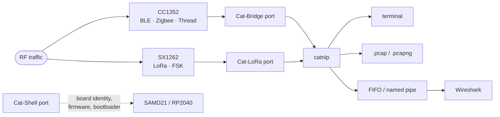

# Usage

The path from a board in a box to packets on screen, in the order you actually
walk it. Each step links to the page that documents it in full; nothing here is
repeated from those pages.

- [The pipeline](#the-pipeline)
- [First run, once per machine](#first-run)
- [Every session](#every-session)
- [Where the packets go](#where-the-packets-go)
- [Quick links](#quick-links)

---

<a id="the-pipeline"></a>
## The pipeline

A CatSniffer is three chips behind one USB cable, and which chip you are using
decides which port carries the traffic and which firmware has to be on the
board:



**The firmware must match the protocol.** The CC1352 holds exactly one image at
a time: Sniffle for BLE, the TI sniffer for Zigbee and Thread, the AirTag
scanner for Find My beacons. Switching protocol means reflashing, which
[`sniff`](commands/sniff.md) does for you. The SX1262 is a different story: it
is driven by the firmware already on the host MCU, over the Cat-LoRa port, so
`sniff lora` and `sniff fsk` never flash anything — they configure a radio.
That is why those two take frequency, spreading factor and bandwidth where the
2.4 GHz subcommands take a firmware image.

---

<a id="first-run"></a>
## First run, once per machine

```sh
# 1. Linux only: udev rules and group membership, so the ports are usable
#    without sudo. Log out and back in afterwards.
sudo catnip setup-env

# 2. Tab completion for every command, subcommand and flag (Linux/macOS)
catnip completion install && exec $SHELL

# 3. Confirm the board is seen: three ports, one row per board
catnip devices
```

If step 3 lists nothing, stop here — no other command will find the board
either. [Troubleshooting](troubleshooting.md#no-devices) works through the
causes in order.

Installing catnip itself is covered in [Installation](installation.md).

---

<a id="every-session"></a>
## Every session

```sh
# 1. What is connected, and what is it running?
catnip status

# 2. Something looks wrong? Exercise the board instead of trusting its report
catnip verify

# 3. Find the channel before capturing on it (802.15.4 only)
catnip cativity

# 4. Capture. The firmware it needs gets flashed on the way in
catnip sniff zigbee -c 15 -ws -w capture.pcap
```

The shape of that last line is the same for every protocol: pick the
subcommand, tell it where to listen, and say where the packets should go.

| You want to | Start at |
|---|---|
| Know which board this is, and what is on it | [`status`](commands/status.md) |
| Prove the hardware works | [`verify`](commands/verify.md) |
| Find the busy 802.15.4 channel | [`cativity`](commands/cativity.md) |
| Capture BLE, Zigbee, Thread, LoRa or FSK | [`sniff`](commands/sniff.md) |
| Survey the sub-GHz band before choosing settings | [`lora spectrum`](commands/lora.md#lora-spectrum) |
| Decode a Meshtastic mesh | [`meshtastic`](commands/meshtastic.md) |
| Use the board as a Linux Bluetooth adapter | [`vhci`](commands/vhci.md) |
| Put a specific image on the CC1352 | [`flash`](commands/flash.md) |
| Rescue a board that stopped answering | [`restore`](commands/restore.md) |

---

<a id="where-the-packets-go"></a>
## Where the packets go

The capture flags are not exclusive — one run can feed all four sinks at once:

| Flag | Sink | Use it when |
|---|---|---|
| *(none)* | Terminal | You are watching, not recording. |
| `-ws, --wireshark` | Live FIFO into Wireshark | You want dissection as packets arrive. |
| `-w, --write FILE` | `.pcap` / `.pcapng` on disk | You want the capture afterwards, for tshark or a report. |
| `-r, --raw FILE` / `-ascii FILE` | Hex or ASCII log | You want the bytes, not a dissector's opinion of them. |

```sh
catnip sniff zigbee -c 15 -ws -w capture.pcap    # watch live and keep the file
```

`-w` refuses to overwrite an existing file unless you add `-f/--force`: a second
PCAP header appended mid-file produces a capture no dissector reads past.

Wireshark integration — the extcap plugins, the FIFO, the LoRa dissector — is
documented in [Wireshark](wireshark.md).

---

<a id="quick-links"></a>
## Quick links

Every command page opens with a *Quick Start* block you can paste:

| Page | Covers |
|---|---|
| [devices](commands/devices.md) | `devices`, `identify`, the three-port architecture |
| [status](commands/status.md) | board generation, firmware, capabilities |
| [verify](commands/verify.md) | shell, LoRa config and LoRa transmission tests |
| [flash](commands/flash.md) | `flash`, `update`, the image catalogue |
| [restore](commands/restore.md) | CC1352 recovery when the bootloader is gone |
| [sniff](commands/sniff.md) | `ble`, `zigbee`, `thread`, `lora`, `fsk`, `airtag_scanner`, `profiles` |
| [cativity](commands/cativity.md) | 802.15.4 channel activity and topology |
| [meshtastic](commands/meshtastic.md) | `decode`, `live`, `dashboard`, `config` |
| [lora](commands/lora.md) | `spectrum`, `scan` |
| [vhci](commands/vhci.md) | `check`, `start` — CatSniffer as `hciX` |
| [setup-env](commands/setup-env.md) | udev rules and groups (Linux) |
| [completion](commands/completion.md) | shell tab completion |

---

## See also

- Global options, device selection, exit codes: [Reference](reference.md).
- When a step above fails: [Troubleshooting](troubleshooting.md).
- What is not supported on your platform: [Limitations](limitations.md).
