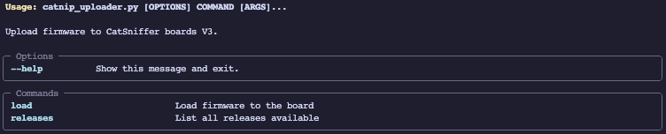
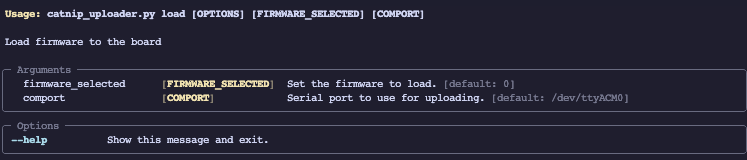

This script works to upload firmware from the releases page to the CatSniffer Board V3.x.
>[!IMPORTANT]
>The current version of the **Catnip** requires the lasted version of the [**SerialPassthroughwithboot**](https://github.com/ElectronicCats/CatSniffer-Firmware/releases/download/board-v3.x-v1.1.0/SerialPassthroughwithboot_RP2040_v1.1.uf2)
## Getting Starter
The struct files from the repo is:
``` bash
.catnip-uploader:
├── catnip_uploader.py
├── cc2538.py
├── releases.json
└── requirements.txt
```

To initialize first we need to install de dependencies packets from the *requirements.txt*.

>[!NOTE]
>We recommend use virtual environment to avoid dependencies errors.

To install de requirements run the next command:  `pip install -r requirements.txt`
Requirements packets:
- `typer==0.9.0`
- `pyserial==3.5`
- `requests==2.31.0`
- `intelhex==2.3.0`
- `python-magic==0.4.27`

>[!IMPORTANT]
>To install **python-magic** may have additional dependencies depending on your OS, [read more](https://github.com/ahupp/python-magic#dependencies):

### Available commands


#### Releases

Show the current releases loaded from the board version 3
##### Usage
To show the current releases run the next command:
```bash
$> python catnip_uploader.py releases
[INFO] Using local releases: /Users/seecwinter/Documents/Electronic_cats/CatSniffer-Tools/catnip_uploader/releases_board-v3.x-v1.1.0 with tag version: board-v3.x-v1.1.0
                                                                           Releases
┏━━━━━━━━━━━━━━━━━━━━━━━━━━┳━━━━━━━━━━━━━━━━━━━━━━━━━━━━━━━━━━━━━━━━━━━━━━━━━━━━━━━━━━━━━━━━━━━━━━━━━━━━━━━━━━━━━━━━━━━━━━━━━━━━━━━━━━━━━━━━━━━━━━━━━━━━━━━━━┓
┃ Firmware                 ┃ Description                                                                                                                     ┃
┡━━━━━━━━━━━━━━━━━━━━━━━━━━╇━━━━━━━━━━━━━━━━━━━━━━━━━━━━━━━━━━━━━━━━━━━━━━━━━━━━━━━━━━━━━━━━━━━━━━━━━━━━━━━━━━━━━━━━━━━━━━━━━━━━━━━━━━━━━━━━━━━━━━━━━━━━━━━━━┩
│ sniffle_cc1352p_7        │ BLE sniffer for Bluetooth 5 and 4.x (LE) from NCC Group. See [Sniffle](https://github.com/nccgroup/Sniffle) (Windows/Linux/Mac) │
│ sniffer_fw_cc1252p_7     │ Multiprotocol sniffer from Texas Instrument (Windows)                                                                           │
│ airtag_scanner_cc1352p_7 │ Apple Airtag Scanner firmware (Windows/Linux/Mac)                                                                               │
│ airtag_spoofer_cc1352p_7 │ Apple Airtag Spoofer firmware (Windows/Linux/Mac)                                                                               │
└──────────────────────────┴─────────────────────────────────────────────────────────────────────────────────────────────────────────────────────────────────┘
```
#### Load

Load  the selected firmware to the board, this command have two options.
- **Firmware**: This options is a integer value from the index of the available firmware releases
- **Comport**: The Path to the board serial com
- **validate**: With this parameter the firmware will upload without confirmation
##### Usage
>[!NOTE]
>First you need to know the index of the firmware you want to upload, exec the **releases** command if you don't know what index you need.
```shell
ython catnip_uploader.py load --help
[INFO] Using local releases: /Users/seecwinter/Documents/Electronic_cats/CatSniffer-Tools/catnip_uploader/releases_board-v3.x-v1.1.0 with tag version: board-v3.x-v1.1.0

 Usage: catnip_uploader.py load [OPTIONS] FIRMWARE [COMPORT]

 Load firmware to CatSniffer boards V3.

╭─ Arguments ──────────────────────────────────────────────────────────────────────────────────────────────────────────────────────────────────────────────────────────────────────────────────────────────────────────────────────────────────────────────────────────────────────╮
│ *    firmware      TEXT       Name of the firmware to load, or the path to the firmware file [default: None] [required]                                                                                                                                                                                                        │
│      comport       [COMPORT]  COM port [default: (dynamic)]                                                                                                                                                                                                                      │
╰──────────────────────────────────────────────────────────────────────────────────────────────────────────────────────────────────────────────────────────────────────────────────────────────────────────────────────────────────────────────────────────────────────────────────╯
╭─ Options ────────────────────────────────────────────────────────────────────────────────────────────────────────────────────────────────────────────────────────────────────────────────────────────────────────────────────────────────────────────────────────────────────────╮
│ --validate    --no-validate      Bypass validation [default: no-validate]                                                                                                                                                                                                        │
│ --help                           Show this message and exit.                                                                                                                                                                                                                     │
╰──────────────────────────────────────────────────────────────────────────────────────────────────────────────────────────────────────────────────────────────────────────────────────────────────────────────────────────────────────────────────────────────────────────────────╯

```

#### Load firmware with confirmation
```shell
python catnip_uploader.py load sniffer /dev/tty.usbmodem133101
[INFO] Using local releases: /Users/seecwinter/Documents/Electronic_cats/CatSniffer-Tools/catnip_uploader/releases_board-v3.x-v1.1.0 with tag version: board-v3.x-v1.1.0
[SUCCESS] Connected to /dev/tty.usbmodem133101
[WARNING] ==================== Validation is enabled. ====================
Are you sure you want to load the firmware: /Users/seecwinter/Documents/Electronic_cats/CatSniffer-Tools/catnip_uploader/releases_board-v3.x-v1.1.0/sniffer_fw_CC1352P_7_v1.10.hex?
 [y/N]: y
[SUCCESS] Loading firmware: /Users/seecwinter/Documents/Electronic_cats/CatSniffer-Tools/catnip_uploader/releases_board-v3.x-v1.1.0/sniffer_fw_CC1352P_7_v1.10.hex
Opening port /dev/tty.usbmodem133101, baud 500000
Reading data from /Users/seecwinter/Documents/Electronic_cats/CatSniffer-Tools/catnip_uploader/releases_board-v3.x-v1.1.0/sniffer_fw_CC1352P_7_v1.10.hex
Firmware file: Intel Hex
Connecting to target...
ERROR: Timeout waiting for ACK/NACK after 'Synch (0x55 0x55)'
[SUCCESS] Firmware loaded successfully.
```


#### Load firmware without confirmation
```bash
$> python catnip_uploader.py load sniffer /dev/tty.usbmodem133101 --validate
[INFO] Using local releases: /Users/seecwinter/Documents/Electronic_cats/CatSniffer-Tools/catnip_uploader/releases_board-v3.x-v1.1.0 with tag version: board-v3.x-v1.1.0
[SUCCESS] Connected to /dev/tty.usbmodem133101
[SUCCESS] Loading firmware: /Users/seecwinter/Documents/Electronic_cats/CatSniffer-Tools/catnip_uploader/releases_board-v3.x-v1.1.0/sniffer_fw_CC1352P_7_v1.10.hex
Opening port /dev/tty.usbmodem133101, baud 500000
Reading data from /Users/seecwinter/Documents/Electronic_cats/CatSniffer-Tools/catnip_uploader/releases_board-v3.x-v1.1.0/sniffer_fw_CC1352P_7_v1.10.hex
Firmware file: Intel Hex
Connecting to target...
CC1350 PG2.0 (7x7mm): 704KB Flash, 20KB SRAM, CCFG.BL_CONFIG at 0x000AFFD8
Primary IEEE Address: 00:12:4B:00:2A:79:BF:AC
    Performing mass erase
Erasing all main bank flash sectors
    Erase done
Writing 720896 bytes starting at address 0x00000000
Write 208 bytes at 0x000AFF308
    Write done
Verifying by comparing CRC32 calculations.
    Verified (match: 0x52c24bf8)
[SUCCESS] Firmware loaded successfully.
```

#### Load custom firmware
```shell
python catnip_uploader.py load /Users/seecwinter/Documents/Electronic_cats/CatSniffer-Firmware/CC1352P7/Sniffle_CC1352P_7/sniffle.hex /dev/tty.usbmodem133101 --validate
[INFO] Using local releases: /Users/seecwinter/Documents/Electronic_cats/CatSniffer-Tools/catnip_uploader/releases_board-v3.x-v1.1.0 with tag version: board-v3.x-v1.1.0
[SUCCESS] Connected to /dev/tty.usbmodem133101
[SUCCESS] Loading firmware: /Users/seecwinter/Documents/Electronic_cats/CatSniffer-Firmware/CC1352P7/Sniffle_CC1352P_7/sniffle.hex
Opening port /dev/tty.usbmodem133101, baud 500000
Reading data from /Users/seecwinter/Documents/Electronic_cats/CatSniffer-Firmware/CC1352P7/Sniffle_CC1352P_7/sniffle.hex
Firmware file: Intel Hex
Connecting to target...
CC1350 PG2.0 (7x7mm): 704KB Flash, 20KB SRAM, CCFG.BL_CONFIG at 0x000AFFD8
Primary IEEE Address: 00:12:4B:00:2A:79:BF:AC
    Performing mass erase
Erasing all main bank flash sectors
    Erase done
Writing 720896 bytes starting at address 0x00000000
Write 208 bytes at 0x000AFF300
    Write done
Verifying by comparing CRC32 calculations.
    Verified (match: 0x7eae001a)
[SUCCESS] Firmware loaded successfully.
```

After finished you can use the CatSniffer with the selected firmware.

## Changelog
- Load firmware with a word, we can now use a "sniffle" insted of index
- Load a non release firmware using the path
- Better performance
