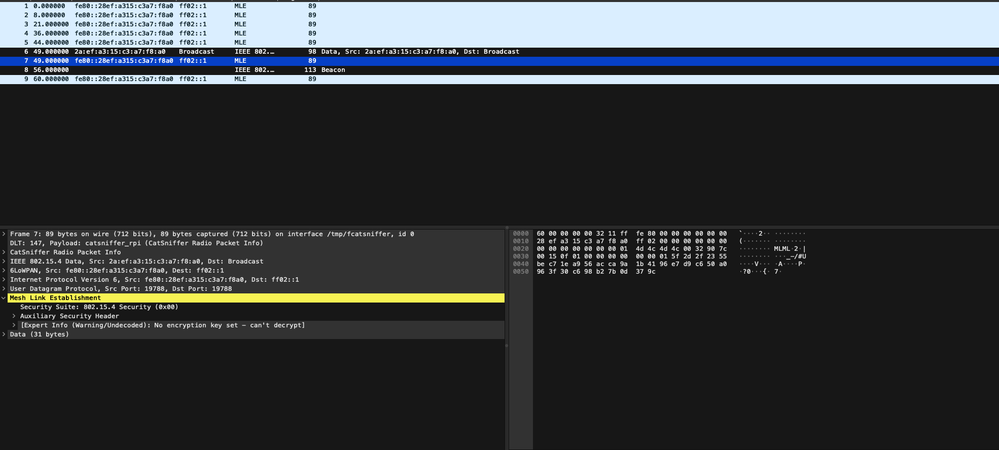
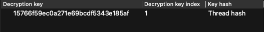
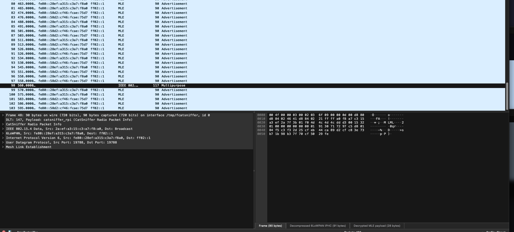
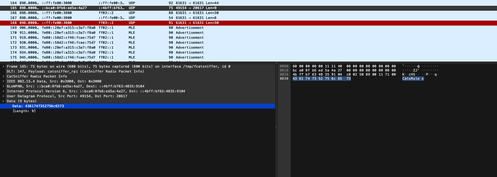

# Requirements
- Two ESP32H2 or C6
- Catsniffer
- Pycatsniffer
# Catsniffer - Load firmware

Clone the tools repo:
```shell
git clone https://github.com/ElectronicCats/CatSniffer-Tools.git
cd CatSniffer-Tools
```
## Catnip
Install the requirements
```shell
cd catnip_uploader
pip install -r requirement.txt
```

Get the releases
```shell
python catnip_uploader.py releases
[INFO] Using local releases: /Users/seecwinter/Documents/Electronic_cats/CatSniffer-Tools/catnip_uploader/releases_board-v3.x-v1.1.0 with tag version: board-v3.x-v1.1.0
                                                                          Releases
┏━━━━━━━━━━━━━━━━━━━━━━━━━━┳━━━━━━━━━━━━━━━━━━━━━━━━━━━━━━━━━━━━━━━━━━━━━━━━━━━━━━━━━━━━━━━━━━━━━━━━━━━━━━━━━━━━━━━━━━━━━━━━━━━━━━━━━━━━━━━━━━━━━━━━━━━━━━━┓
┃ Firmware                 ┃ Description                                                                                                                   ┃
┡━━━━━━━━━━━━━━━━━━━━━━━━━━╇━━━━━━━━━━━━━━━━━━━━━━━━━━━━━━━━━━━━━━━━━━━━━━━━━━━━━━━━━━━━━━━━━━━━━━━━━━━━━━━━━━━━━━━━━━━━━━━━━━━━━━━━━━━━━━━━━━━━━━━━━━━━━━━┩
│ sniffle_cc1352p_7        │ BLE sniffer for Bluetooth 5 and 4.x (LE) from NCC Group. See [Sniffle](https://github.com/nccgroup/Sniffle)                   │
│                          │ (Windows/Linux/Mac)                                                                                                           │
│ sniffer_fw_cc1252p_7     │ Multiprotocol sniffer from Texas Instrument (Windows)                                                                         │
│ airtag_scanner_cc1352p_7 │ Apple Airtag Scanner firmware (Windows/Linux/Mac)                                                                             │
│ airtag_spoofer_cc1352p_7 │ Apple Airtag Spoofer firmware (Windows/Linux/Mac)                                                                             │
└──────────────────────────┴───────────────────────────────────────────────────────────────────────────────────────────────────────────────────────────────┘

```

Load the `sniffer_fw_cc1252p7`
```shell
python catnip_uploader.py load sniffer /dev/tty.usbmodem13201
[INFO] Using local releases: /Users/seecwinter/Documents/Electronic_cats/CatSniffer-Tools/catnip_uploader/releases_board-v3.x-v1.1.0 with tag version: board-v3.x-v1.1.0
[SUCCESS] Connected to /dev/tty.usbmodem13201
[WARNING] =============== Validation is enabled. ===============
Are you sure you want to load the firmware: /Users/seecwinter/Documents/Electronic_cats/CatSniffer-Tools/catnip_uploader/releases_board-v3.x-v1.1.0/sniffer_fw_CC1352P_7_v1.10.hex?
 [y/N]: y
[SUCCESS] Loading firmware: /Users/seecwinter/Documents/Electronic_cats/CatSniffer-Tools/catnip_uploader/releases_board-v3.x-v1.1.0/sniffer_fw_CC1352P_7_v1.10.hex
Opening port /dev/tty.usbmodem13201, baud 500000
Reading data from /Users/seecwinter/Documents/Electronic_cats/CatSniffer-Tools/catnip_uploader/releases_board-v3.x-v1.1.0/sniffer_fw_CC1352P_7_v1.10.hex
Firmware file: Intel Hex
Connecting to target...
CC1350 PG2.0 (7x7mm): 704KB Flash, 20KB SRAM, CCFG.BL_CONFIG at 0x000AFFD8
Primary IEEE Address: 00:12:4B:00:2A:79:BF:AC
    Performing mass erase
Erasing all main bank flash sectors
    Erase done
Writing 720896 bytes starting at address 0x00000000
Write 208 bytes at 0x000AFF308
    Write done
Verifying by comparing CRC32 calculations.
    Verified (match: 0x52c24bf8)
[SUCCESS] Firmware loaded successfully.
```

Then reboot your board.
## Using Pycatsniffer
### Adding our filters profiles
- Open Wireshark
- `Edit` -> `Configuration Profiles`
- `Import` -> `From Zip File` -> Locate the zip file in the folder `filter_profiles` from the repo
- Then `Ok`

> If the **filters profiles** are not imported, with the latest version of pycatsniffer with the *Thread* command support, wireshark will not open an error will be displayed: `󰄛 - PycatSniffer CLI> wireshark: Configuration Profile "Thread" does not exist` or `󰄛 - PycatSniffer CLI> wireshark: Configuration Profile "Zigbee" does not exist`

### Adding our dissectors
- Open Wireshark
- * `About Wireshark` -> `Folders`
- Locate `Personal Plugins` in the *name* column and doble click in the `Location` column
- Once the folder are open, copy the `catsniffer.` from the `dissectors` folder

>  * About wireshark in macos are in the `Wireshark` menu and Windows and Linux are in `Help` menu

**Note**: The `catnisffer.` refers to the name of the file that you operative systems needs:
- `catsniffer.so`: Macos
- `catsniffer.so`: Linux
- `catsniffer.dll`: Windows
For more information about the differences between the Linux and Macos dissector, please check our wiki.

### Install requirements
```shell
pip install -r requirements.txt
```
# Openthread - Install example
## ESP-IDF
### Get the repo
```shell
git clone https://github.com/espressif/esp-idf
cd esp-idf
git submodule update --init --recursive
./install.sh
./export.sh
```

### Load the example
```shell
cd examples/openthread/ot_cli
idf.py set-target esp32h2
idf.py -p {PORT} erase-flash flash monitor
```

> Some configuration with the developer board can not working with the USB connection, then use the serial interface

## OT Border Router - Commissioner

```shell
> dataset init new

Done
> dataset

Active Timestamp: 1
Channel: 13
Channel Mask: 0x07fff800
Ext PAN ID: 5313f58f402c1819
Mesh Local Prefix: fd96:26d8:408f:b50e::/64
Network Key: 15766f59ec0a271e69bcdf5343e185af
Network Name: OpenThread-2102
PAN ID: 0x2102
PSKc: 004e5d0799d448f8ec7b30eafab082e7
Security Policy: 672 onrc 0
Done
> dataset commit active

Done
> ifconfig up

Done
I (350303) OT_STATE: netif up
> thread start

I(361183) OPENTHREAD:[N] Mle-----------: Role disabled -> detached
Done
> I(361643) OPENTHREAD:[N] Mle-----------: Attach attempt 1, AnyPartition reattaching with Active Dataset
I(368243) OPENTHREAD:[N] RouterTable---: Allocate router id 12
I(368243) OPENTHREAD:[N] Mle-----------: RLOC16 fffe -> 3000
I(368243) OPENTHREAD:[N] Mle-----------: Role detached -> leader
I(368263) OPENTHREAD:[N] Mle-----------: Partition ID 0x52de31e6
# After a moment, check the device state, when the state is 'Leader' then the network it is ready
> state
leader
Done
>
```

**Commands**:
- `dataset init new`: Create a new network
- `dataset`: Show the network details
- `dataset commit active`: Setting up the configuration and set as active
- `ifconfig up`: Activate the phy interface
- `thread start`: Activate the thread service
- `state`: Show the device status

## OT End device
```shell
> dataset networkkey 15766f59ec0a271e69bcdf5343e185af

Done
> dataset commit active

Done
> ifconfig up

Done
I (2479103) OT_STATE: netif up
> thread start

I(2484933) OPENTHREAD:[N] Mle-----------: Role disabled -> detached
Done
> I(2485463) OPENTHREAD:[N] Mle-----------: Attach attempt 1, AnyPartition reattaching with Active Dataset
I(2492073) OPENTHREAD:[N] Mle-----------: Attach attempt 1 unsuccessful, will try again in 0.284 seconds
I(2492373) OPENTHREAD:[N] Mle-----------: Attach attempt 2, AnyPartition
I(2494743) OPENTHREAD:[N] Mle-----------: Delay processing Announce - channel 13, panid 0x2102
I(2495013) OPENTHREAD:[N] Mle-----------: Processing Announce - channel 13, panid 0x2102
I(2495013) OPENTHREAD:[N] Mle-----------: Role detached -> disabled
I(2495023) OPENTHREAD:[N] Mle-----------: Role disabled -> detached
I(2495493) OPENTHREAD:[N] Mle-----------: Attach attempt 1, AnyPartition
I(2496323) OPENTHREAD:[N] Mle-----------: RLOC16 fffe -> 3001
I(2496323) OPENTHREAD:[N] Mle-----------: Role detached -> child
> state

child
Done
```

**Commands**:
- `dataset networkkey`: Set the networkkey with the Border Route entwork
- `dataset commit active`: Setting up the configuration and set as active
- `ifconfig up`: Activate the phy interface
- `thread start`: Activate the thread service
- `state`: Show the device status

# Catsniffer - Sniffing the network
## Starting the sniffing
```shell
python cat_sniffer.py sniff -phy Thread -ff -ws -c 13

      :-:              :--       |
      ++++=.        .=++++       |
      =+++++===++===++++++       |
      -++++++++++++++++++-       |  Module:  PycatSniffer CLI
 .:   =++---++++++++---++=   :.  |  Author:  JahazielLem
 ::---+++.   -++++-   .+++---::  |  Version: 1.0.0
::1..:-++++:   ++++   :++++-::.::|  Company: Electronic Cats - PWNLab
.:...:=++++++++++++++++++=:...:. |
 :---.  -++++++++++++++-  .---:  |
 ..        .:------:.        ..  |


        Catsniffer Information
┏━━━━━━━━━━━━━┳━━━━━━━━━━━━━━━━━━━━━━━┓
┃ Information ┃ Value                 ┃
┡━━━━━━━━━━━━━╇━━━━━━━━━━━━━━━━━━━━━━━┩
│ COM Port    │ /dev/cu.usbmodem13201 │
│ PHY         │ Thread                │
│ Channel     │ 13                    │
└─────────────┴───────────────────────┘
PyCat-Sniffer CLI - For sniffing the TI CC1352 device communication inferfaces.
Type help or ? to list commands.

󰄛 - PycatSniffer CLI>
```

Wireshark open with listening in the channel 13


## Setting up the network key
- `Preferences` -> `Protocols`
- `IEEE 802.15.4` -> `Decryption Keys` Click on `Edit` button
- Click on `+` button and paste the network key in the `Decryption key` field
- `Decryption key index`: 1
- `Key Hash`: Thread hash



Once you save, Wireshark will show something like:


## View UDP Packets
In the OT Border Router:
```shell
> udp open

Done
> udp bind :: 20617

Done
> ipaddr

fd96:26d8:408f:b50e:0:ff:fe00:fc00       # Routing Locator (RLOC)
fd96:26d8:408f:b50e:0:ff:fe00:3000
fd96:26d8:408f:b50e:4bff:b763:4835:9104  # Mesh-Local EID (ML-EID)
fe80:0:0:0:28ef:a315:c3a7:f8a0           # Link-Local Address (LLA)
Done
```

In the End device:
```shell
udp open
udp send fd96:26d8:408f:b50e:4bff:b763:4835:9104 20617 CatsRules
```

The Border Router recived:
```shell
> 9 bytes from fd96:26d8:408f:b50e:bca0:8fb6:ed5a:4a27 49154 CatsRules
```


